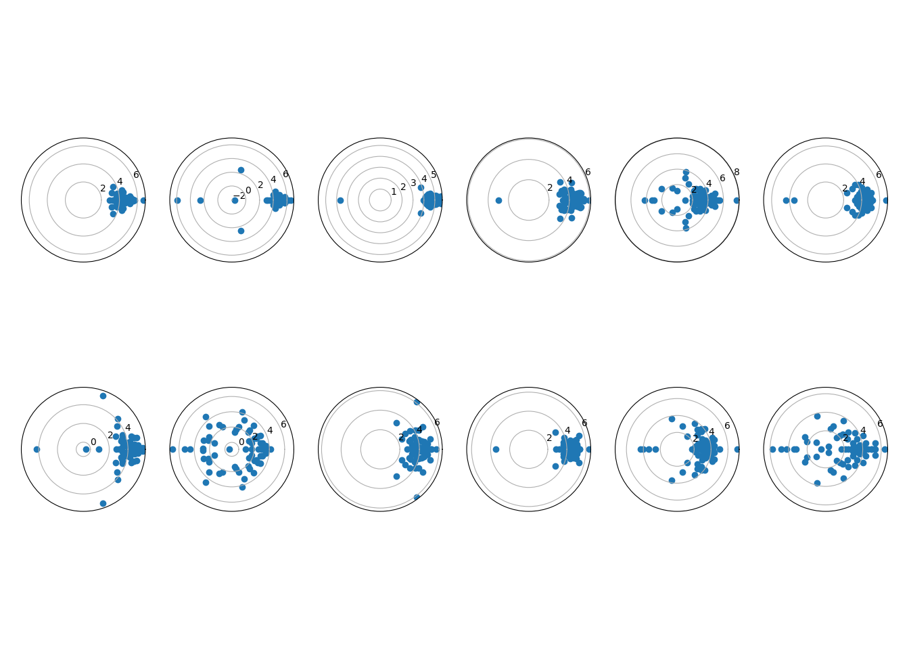
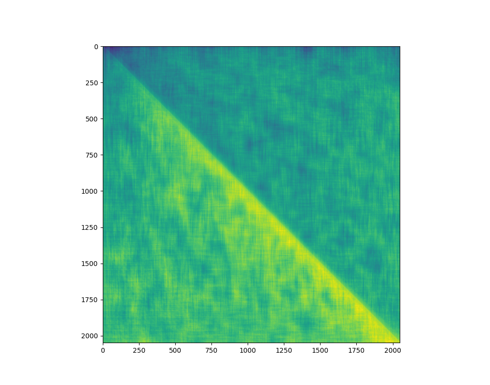

## One Layer Attention-Only Model

### OV Circuit Eigenvalues

We see that most of the heads are copying.


### Primarily Positional heads
An example of a head which attends to relative positions.



```
Source token is " couldn"

head 5
max difference between values of positional attention:
296.13678  -- this is the larges value of all the heads.

source to out
[b' be', b' confirm', b' agree', b' afford', b' imagine']
[0.38773345947265625, 0.3833295404911041, 0.3782491981983185, 0.3716591000556946, 0.3678983449935913]
```
