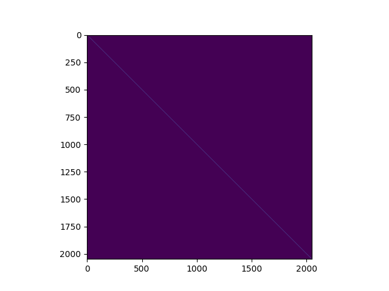

## One Layer Attention-Only Model

### OV Circuit Eigenvalues

We see that most of the heads are copying.


### Primarily Positional heads
An example of a head which attends to relative positions.



```
Source token is " couldn"

head 7
positional max:  0.7909727604606841
positional argmax: 1
diagonal averages: [0.18168114125728607, 0.7909727604606841, 0.008146629609807242, 2.707103926788058e-06, 2.57885112736893e-09]
# we see that the head is attending to the previous token

source to out
[b't', b' withstand', b' muster', b' resist', b' afford']
[0.38662932469763645, 0.30651281808730035, 0.3045753372062454, 0.3025967248920731, 0.29406388294649466]
source to dest
[b't', b',', b' to', b' also', b'\x99']
[29.83683462898018, 28.307687221821457, 24.972130477025836, 24.70400140563445, 24.353694316663237]
```
