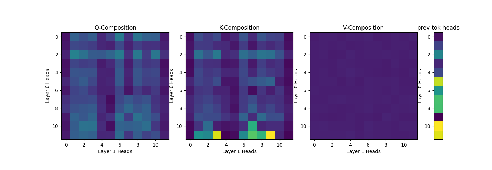

## Two-Layer Attention-Only Model

### Q, K and V Composition

We see from the array on the right that layer-0 head 11 is a previous token head. Layer-1 heads 3, 7, and 9 k-compose with this previous token head.

Another observation is that the induction heads (layer-1 heads 3, 7, and 9) also slightly k-compose with layer-0 head 2. Turns out layer-0 head 2 attends to tokens two tokens back.

## Attention visualisation
https://slavachalnev.github.io/circuits/analysis/potter.html
